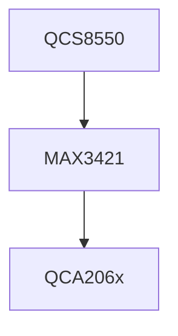

Bluetooth Not Working on QCA2066 Based WiFi+BT Module with QCS8550
====
WiFi+BT Module QCA2066 is connected to QCS8550 base SOM module over PCIe(for WiFi) and SPI-to-USB MAX3421 chip (for BT)



We're facing issue of BT test app not working. We spent lot of time debugging bt-app,  Fluoride Stack and BT USB driver.
bt-app logcat was showing , BT command transfer from fluoride stack to BT USB driver , however it was not getting response form driver .


Then , we have enabled BT USB driver logs.  BT USB driver was creating control, bulk & interrupt endpoints successfully.
These're logical endpoints , and they're used by USB core to transfer different types for data (URB) on USB devices.
The host will periodically poll the interrupt endpoint. This rate of polling is specified in the endpoint descriptor which is covered later. 
Each poll will involve the host sending an IN Token. 

Endpoint Descriptor
----

*bEndpointAddress* indicates what endpoint this descriptor is describing.

*bmAttributes* specifies the transfer type. This can either be Control, Interrupt, Isochronous or Bulk Transfers. 
If an Isochronous endpoint is specified, additional attributes can be selected such as the Synchronisation and usage types.

*wMaxPacketSize* indicates the maximum payload size for this endpoint.

*bInterval* is used to specify the polling interval of certain transfers. 
The units are expressed in frames, thus this equates to either 1ms for low/full speed devices and 125us for high speed devices.

ref: https://www.beyondlogic.org/usbnutshell/usb4.shtml#Control

Kernel Log
----
```
 169.884900][ T4199] QBTUSB: btusb_firmware_upgrade: Start Downloading BT firmware
[  174.802325][ T4199] QBTUSB: btusb_firmware_upgrade: Succeed Download BT firmware
[  174.802337][ T4199] bt_usb0: probing interfaces
[  174.802545][ T4199] bt_usb0: Control endpoint set 
[  174.802573][ T4199] bt_usb0: INTR in int 1 mps 16 EP = 129
[  174.802608][ T4199] bt_usb0: BULK in int 0 mps 64 ep = 130
[  174.802636][ T4199] bt_usb0: BULK out int 0 mps 64
[  174.807608][ T4199] bt_usb0: ISOC in int 1 mps 33
[  174.807625][ T4199] bt_usb0: ISOC out int 1 mps 33
[  174.808513][ T4199] usbcore: registered new interface driver btusb
[  174.811910][ T4199] BT_USB: bt_usb_init done!
```


MAX3421 USB Host Controller Driver
----
MAX3421 is a chip implementing a USB 2.0 Full-/Low-Speed host controller on a SPI bus. 

* Driver in mainline kernel
   https://github.com/torvalds/linux/blob/master/drivers/usb/host/max3421-hcd.c
* MAX3421E datasheet
	https://datasheets.maximintegrated.com/en/ds/MAX3421E.pdf
* MAX3421E Programming Guide
	https://www.hdl.co.jp/ftpdata/utl-001/AN3785.pdf
* gadget/dummy_hcd.c
	For USB HCD implementation.
* Arduino MAX3421 driver
     https://github.com/felis/USB_Host_Shield_2.0/blob/master/Usb.cpp
  
Packet size constraints
 *	control:	  64 bytes
 *	isochronous:	1023 bytes
 *	interrupt:	  64 bytes
 *	bulk:		  64 bytes


BT USB driver sends/receives USB packets from QCA2066 module through MAX3421 host controller driver (drivers/usb/host/max3421-hcd.c).
max3421-hcd driver provides virtual USB device to the host and it is responsible for coverting SPI data into USB packets.  
This driver runs a thread,  , which is responsible for all URB (INT & BULK )transfers. It processes single URB(either INT, CONTROL or BULK) in one iteration. 

URB enqueue requests are added into linked list using max3421_urb_enqueue() function. 
```
max3421_urb_enqueue(struct usb_hcd *hcd, struct urb *urb, gfp_t mem_flags)
{
...
	if (!max3421_ep) {
		/* gets freed in max3421_endpoint_disable: */
		max3421_ep = kzalloc(sizeof(struct max3421_ep), GFP_ATOMIC);
		if (!max3421_ep) {
			retval = -ENOMEM;
			goto out;
		}
		max3421_ep->ep = urb->ep;
		max3421_ep->last_active = max3421_hcd->frame_number;
		urb->ep->hcpriv = max3421_ep;

		list_add_tail(&max3421_ep->ep_list, &max3421_hcd->ep_list);
	}
...

}
```

max3421_spi_thread() thread function processes this ep list using function max3421_select_and_start_urb()


```
static int max3421_select_and_start_urb(struct usb_hcd *hcd)
{
...
	urb = max3421_hcd->curr_urb = curr_urb;
	epnum = usb_endpoint_num(&urb->ep->desc);
	if (max3421_ep->retransmit)
		/* restart (part of) a USB transaction: */
		max3421_ep->retransmit = 0;
	else {
		/* start USB transaction: */
		if (usb_endpoint_xfer_control(&ep->desc)) {
			/*
			 * See USB 2.0 spec section 8.6.1
			 * Initialization via SETUP Token:
			 */
			usb_settoggle(urb->dev, epnum, 0, 1);
			usb_settoggle(urb->dev, epnum, 1, 1);
			max3421_ep->pkt_state = PKT_STATE_SETUP;
		} else
			max3421_ep->pkt_state = PKT_STATE_TRANSFER;
	}
...
}
```
Since the default poll interval for INT EP was set to 1 frame, max3421 driver's thread was continuously polling for IN data from INT endpoint and Control/Bulk transfer were never got scheduled. 
Therefore, BT device was not responding with any data on INT endpoint and we're getting continuoud NACK on INT endpoints.

When we enabled debug log in max3421-hcd driver , we were getting below statastics 

```
[  130.353804][  T703] *** EIC *** max3421_set_speed :481 
[  130.353812][  T703] *** EIC *** max3421_next_transfer :601 
[  130.353819][  T703] *** EIC *** max3421_transfer_in :538 
[  130.354102][  T703] *** EIC *** max3421_handle_irqs :1222 
[  130.354398][  T703] *** EIC *** max3421_handle_irqs :1233 
[  130.354681][  T703] *** EIC *** max3421_handle_irqs :1244 
[  130.355133][  T703] max3421_handle_irqs: hrsl_stats  0 0 0 0 2255 0 0 0 0 0 0 0 0 0 0 0
[  130.355144][  T703] EP2 1 lst 0864 rtr 0 nak      0 rxmt 0: 
[  130.355155][  T703] EP2 1 lst 1964 rtr 0 nak     25 rxmt 1:  ffffff880c081b00(3.IN 0/2041)
[  130.355163][  T703] EP0 2 lst 1982 rtr 0 nak      0 rxmt 0: 
[  130.355171][  T703] EP1 1 lst 1194 rtr 0 nak   5900 rxmt 1:  ffffff880c081500(1.IN 0/16)
[  130.355179][  T703] *** EIC *** max3421_handle_irqs :1222 
[  130.355462][  T703] *** EIC *** max3421_select_and_start_urb :666 

```

Solution
----
When Qualcomm's BT USB driver probes (csrUsbProbe() function in usb_com.c ) BT USB device, it creates CONTROL, BULK IN, BULK OUT and INTERRUPT endpoints.
INTERRUPT endpoint is created by below function

```
static void handleIntrInEndpoint(csr_dev_t *dv, int alt,
                                 struct usb_endpoint_descriptor *endpoint)
{
    dv->intr_ep = endpoint->bEndpointAddress;
    //dv->intr_interval = endpoint->bInterval;
    dv->intr_interval = 32; // ST: Hardcoded Interrupt Interval
        dv->intr_size = endpoint->wMaxPacketSize;

    set_bit(INTR_IN_READY, &dv->endpoint_present);

    printk("bt_usb%u: INTR in int %u mps %u EP = %d\n",
        dv->minor, endpoint->bInterval, dv->intr_size, dv->intr_ep);
}
```

We've changed defualt polling interval from 1 to 32 frames in struct usb_endpoint_descriptor
